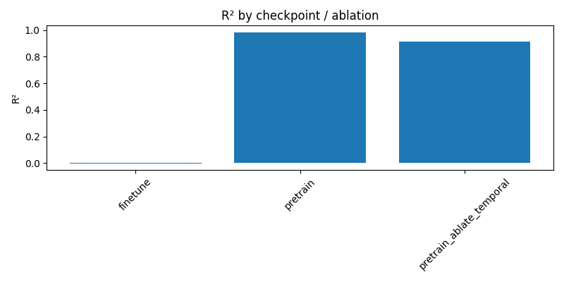

# Relational Transformer (RT) Training Guide

This document captures the end-to-end process for applying the Relational Transformer
technique to tabular/relational datasets within the training framework.

## Pipeline Overview

1. **Input preparation**
   - Each database cell becomes a token formed from its value, column name, and table name.
   - Numeric and boolean values are normalized with per-column statistics.
   - Timestamps are converted to epoch seconds and normalized with global statistics.
   - Text values and schema phrases (“`<column> of <table>`”) are embedded with a frozen MiniLMv2 encoder.
   - Datatype-specific projections `W_d` combine with a shared schema projection `W` to yield the model input.
   - Masked tokens swap their value embedding for a learned mask vector `m_d` but retain the target label for loss.

2. **Context construction**
   - Contexts are sampled with a BFS that starts at the target row, includes all foreign→primary parents, subsamples primary→foreign children (width bound `w`), and enforces temporal causality (`t_row <= t_seed`).
   - Only non-missing feature cells are added until the 1,024-cell limit is reached.

3. **Relational attention**
   - Four sparse attention masks are compiled per layer:
     - **Column attention** – matches cells from the same column.
     - **Feature attention** – mixes the current row with foreign→primary parents.
     - **Neighbor attention** – aggregates from primary→foreign children (GNN-style).
     - **Full attention** – fully connected fallback.
   - Transformer blocks apply the masks in order: Column → Feature → Neighbor → Temporal → Full → Gated MLP.
   - FlashAttention-compatible kernels can be enabled by swapping the attention helper.

4. **Temporal fusion (TFT-inspired)**
   - Per-row timestamps are converted into delta-time, daily, and hourly sinusoidal features.
   - A causal temporal mask restricts attention to historical windows (`context.temporal_lookback_hours`).
   - The new temporal attention layer blends short-term, seasonal, and trend signals before full attention.

5. **Auxiliary link prediction**
   - FK role embeddings distinguish buyer vs. seller (etc.) relationships; `training.link_loss_weight` controls the BCE loss on sampled parent/child edges.
   - Streaming payloads include `edge_index` / `edge_labels`, so link prediction works for both batch and Redis-driven training.

6. **Decoding**
   - Datatype-specific heads map hidden states back to predictions:
     - Boolean: BCE-with-logits.
     - Numeric / datetime: Smooth L1.
   - The masked-token prediction objective (MTP) is used for both pre-training and fine-tuning.

5. **Zero-shot inference**
   - Attach a task table with seed rows and historical labels.
   - Sample contexts with the same BFS algorithm and mask the target cell.
   - Run the model in evaluation mode to produce normalized predictions.

6. **Fine-tuning**
   - Learning rate defaults: 1e-3 (pre-train), 1e-4 (fine-tune) with no weight decay during fine-tuning.
   - Maintain the 1,024-token context and batch size (default 32) for stability.

7. **Model spec**
   - 12 layers, 256 hidden units, 8 heads.
   - Gated MLP with SiLU activation and hidden size 1,024.
   - Value/schema embedding dimensions default to 384 (MiniLMv2).

## Implementation Components

- `models/relational_transformer/data.py`
  - `RelationalDatabase`: in-memory store with dtype inference, stats, and FK adjacency.
  - `ContextSampler`: BFS sampler with width and temporal constraints.
  - `CellTokenizer`: produces typed token embeddings (numeric, boolean, datetime, text) plus hierarchical temporal encodings (delta hours, daily/weekly seasonality) and FK-role embeddings to distinguish primary vs. foreign key semantics.
  - `RelationalDataset`: materializes padded training batches and attention masks, including temporal lookback masking.

- `models/relational_transformer/model.py`
  - `RelationalTransformer`: stack of masked attention blocks plus type-specific decoders, with TFT-style variable selection gating that modulates each column token before attention.
  - `MaskedMultiheadSelfAttention`: boolean-mask friendly attention primitive.

- `models/relational_transformer/training.py`
  - `RelationalTrainer`: orchestrates pre-training and fine-tuning workflows.
  - `RelationalInferenceEngine`: lightweight runtime for loading checkpoints and serving inference on dedicated GPU nodes.
  - `RelationalTrainingConfig`: captures RT hyperparameters.

- `scripts/train_relational_transformer.py`
  - YAML-driven entry point for pre-training, fine-tuning, or zero-shot evaluation.
  - Loads CSV/Parquet tables, builds FK graphs, and manages checkpoints.
- `scripts/profile_rt_inference.py`
  - Profiles latency/throughput for checkpoints using the standalone inference engine so MLOps can validate GPU sizing.
- `tools/export_relational_transformer_repo.py`
  - Copies the full RT stack into a new repository layout that can be pushed to dedicated training/inference infrastructure.
- `tools/export_gpu_stack_repo.py`
  - Builds a consolidated repository containing training, model weights, LocalAI, search, and graph services for GPU deployment.

## Example Configuration

```yaml
tables:
  - name: customers
    path: data/customers.parquet
    format: parquet
    primary_key: customer_id
    timestamp_column: created_at
  - name: loans
    path: data/loans.csv
    format: csv
    primary_key: loan_id
    timestamp_column: booked_at
    foreign_keys:
      - parent_table: customers
        parent_column: customer_id
        child_column: customer_id
        role: customer_lookup
targets:
  - table: loans
    column: default_label
    limit: 5000
context:
  max_cells: 1024
  width_bound: 6
  temporal_lookback_hours: 24
training:
  amp: true
  grad_clip: 1.0
  loss_scale: 1024
  dynamic_loss_scale: true
  link_loss_weight: 0.1
  ablate_column: false
  ablate_feature: false
  ablate_neighbor: false
  ablate_temporal: false
  ablate_full: false
  batch_size: 32
  mask_probability: 0.15
  pretrain_steps: 5000
  fine_tune_steps: 33000
  pretrain_learning_rate: 1e-3
  fine_tune_learning_rate: 1e-4
zero_shot:
  num_examples: 16
```

Run:

```bash
# Pre-train
python scripts/train_relational_transformer.py \
  --config configs/relational_rt.yaml \
  --mode pretrain \
  --auto-resume \
  --checkpoint-out checkpoints/main_schedule/rt_pretrain.pt

# Fine-tune
python scripts/train_relational_transformer.py \
  --config configs/relational_rt.yaml \
  --mode fine-tune \
  --auto-resume \
  --checkpoint-out checkpoints/main_schedule/rt_finetuned.pt

# Zero-shot
python scripts/train_relational_transformer.py \
  --config configs/relational_rt.yaml \
  --mode zero-shot \
  --checkpoint-in checkpoints/main_schedule/rt_finetuned.pt \
  --predictions-out outputs/rt_predictions.json
```

For scheduled runs (CI, cron, etc.), invoke the helper script:

```bash
./scripts/run_rt_main_schedule.sh
```

It executes the pre-train and fine-tune stages back-to-back, auto-resumes from prior checkpoints when present, and keeps `checkpoints/main_schedule/` up to date for downstream jobs. If an evaluation config (default `configs/eval_financed_emission_regression.yaml`) is present, AUROC / R² metrics are logged nightly to `checkpoints/main_schedule/metrics_{pretrain,finetune}.json` via `scripts/eval_relational_transformer.py`. Override the evaluation set with `EVAL_CONFIG=/path/to/eval.yaml ./scripts/run_rt_main_schedule.sh`.
#### Advanced options

`train_relational_transformer.py` exposes extra knobs to improve stability:

- `--resume-from / --auto-resume` reloads the latest checkpoint and continues training without losing optimiser/scaler state.
- `--amp`, `--loss-scale`, and `--disable-dynamic-loss-scale` enable CUDA AMP with configurable scaling.
- `--grad-clip` clamps the gradient norm before each optimiser step; the YAML `training.grad_clip` key mirrors the flag.
- The saved checkpoints now bundle optimiser, AMP scaler, and metadata (`stage=pretrain|fine_tune`) so that resumes behave deterministically.

All flags can be set in the YAML under `training:` and overridden on the CLI when needed.


To remove ageing artifacts from `checkpoints/archive/`, run:

```bash
RETENTION_DAYS=30 ./scripts/cleanup_rt_archives.sh
```

### Automating with cron

Install both scripts on a nightly cadence by adding entries to `crontab -e`:

```
0 2 * * * /usr/bin/env bash /path/to/repo/scripts/run_rt_main_schedule.sh >> /path/to/repo/logs/rt_main_schedule.log 2>&1
30 3 * * 0 RETENTION_DAYS=60 /usr/bin/env bash /path/to/repo/scripts/cleanup_rt_archives.sh >> /path/to/repo/logs/rt_archive_cleanup.log 2>&1
```

Adjust schedules, log paths, and retention to meet your policies. For GitHub Actions or other CI systems, call the same scripts within the workflow steps. A ready-to-import template lives at `cron/rt_pipeline.cron`; update the absolute repository path before loading it via `crontab cron/rt_pipeline.cron`.

### Streaming with Redis Streams

Prerequisite: `pip install redis scikit-learn`.

1. **Produce batches**

   ```bash
   python scripts/rt_stream_producer.py      --config configs/relational_rt.yaml      --redis-url redis://127.0.0.1:6379/0      --redis-stream rt-training      --loop
   ```

   The producer walks the configured dataset, serialises each training sample, and publishes it to `rt-training`. Use `--maxlen` to cap stream size or `--sleep` to throttle publishing.

2. **Consume for training**

   ```bash
   python scripts/train_relational_transformer.py      --config configs/relational_rt.yaml      --mode stream-pretrain      --auto-resume      --checkpoint-out checkpoints/main_schedule/rt_pretrain.pt      --redis-url redis://127.0.0.1:6379/0      --redis-stream rt-training      --redis-group rt-trainer      --redis-consumer $(hostname)-stream
   ```

   Replace `stream-pretrain` with `stream-fine-tune` to continue fine-tuning using streamed batches. The script joins the specified consumer group (`XGROUP` is created on demand), trains for the configured number of steps, acknowledges each message upon successful optimisation, and saves a resume-aware checkpoint.

The streaming mode keeps the core trainer untouched while allowing decoupled data pipelines—swap the producer for one that emits live relational samples, or run multiple consumers for horizontal scaling.

### Nightly Metrics Snapshot

ARC-AGI integration now runs alongside the RT checkpoints. The cron pipeline emits JSON summaries at `checkpoints/main_schedule/arc_metrics/arc_agi_<timestamp>.json` and `arc_agi2_<timestamp>.json`. Each file is the direct output of `aibench run --task=arc` (using the hybrid solver) against the ARC-AGI v1 and v2 suites, so the nightly schedule tracks reasoning accuracy in lockstep with the R²/AUROC metrics.



| Run | R² |
| --- | --- |
| pretrain | 0.9842 |
| finetune | -0.0013 |
| pretrain_ablate_temporal | 0.9150 |
