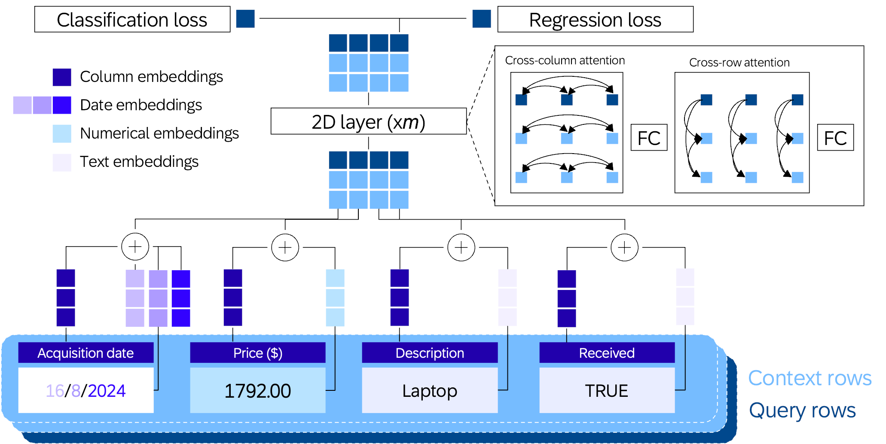

# sap-rpt-1-oss
[](https://arxiv.org/abs/2506.10707) [](https://api.reuse.software/info/github.com/SAP-samples/sap-rpt-1-oss)

> [!NOTE]
> This model and repository were formerly known as **ConTextTab**. While the code and repository have now been updated in line with the new name **sap-rpt-1-oss**, the model checkpoint and functionality remain identical.


## Description

Implementation of the deep learning model with the inference pipeline described in the paper ["ConTextTab: A Semantics-Aware Tabular In-Context Learner"](https://arxiv.org/abs/2506.10707).


## Abstract

Tabular in-context learning (ICL) has recently achieved state-of-the-art (SOTA) performance on several tabular prediction tasks. 
Previously restricted to classification problems on small tables, recent advances such as TabPFN and TabICL have extended its use to larger datasets. 
While being architecturally efficient and well-adapted to tabular data structures, current table-native ICL architectures, being trained exclusively on synthetic data, do not fully leverage the rich semantics and world knowledge contained in real-world tabular data. 
On another end of this spectrum, tabular ICL models based on pretrained large language models such as TabuLa-8B integrate deep semantic understanding and world knowledge but are only able to make use of a small amount of context due to inherent architectural limitations. 
With the aim to combine the best of both these worlds, we introduce **sap-rpt-1-oss** (formerly known under the name **ConTextTab**), integrating semantic understanding and alignment into a table-native ICL framework. 
By employing specialized embeddings for different data modalities and by training on large-scale real-world tabular data, our model is competitive with SOTA across a broad set of benchmarks while setting a new standard on the semantically rich CARTE benchmark.

## Citations

If you use this model in your research or want to refer to our work, please cite:
```
@inproceedings{
spinaci2025contexttab,
title={ConTextTab: A Semantics-Aware Tabular In-Context Learner},
author={Marco Spinaci and Marek Polewczyk and Maximilian Schambach and Sam Thelin},
booktitle={Advances in Neural Information Processing Systems (NeurIPS)},
year={2025},
url={https://openreview.net/forum?id=kGMRb4jbTP}
}
```

## Requirements

This project uses model checkpoints available on https://huggingface.co/sap/sap-rpt-1-oss that are automatically downloaded when running the model.  
Note that downloading the model checkpoints requires logging in to Hugging Face.
See the [instructions](https://huggingface.co/docs/huggingface_hub/quick-start#authentication) for details.

The requirements are detailed in the `requirements.txt` file for Python 3.11 version.

Local development installation:  
```pip install -e .```

Installation from source:  
```pip install git+https://github.com/SAP-samples/sap-rpt-1-oss```


## Basic Usage

The model supports both classification and regression tasks. It accepts input data in the form of a pandas DataFrame or a NumPy array. No preprocessing is required, column names and cell values are automatically embedded using an LLM that is running in the background, and any missing values are handled correctly.

For best performance, use a GPU with at least 80 GB of memory and set the context size to 8192. For large tables, it is recommended to use a bagging factor of 8.

For a light-weight, faster model with lower requirements on the GPU, try lowering the context size to e.g. 2048 and set the bagging factor to 1.

### Classification

```python
from sklearn.datasets import load_breast_cancer
from sklearn.metrics import accuracy_score
from sklearn.model_selection import train_test_split

from sap_rpt_oss import SAP_RPT_OSS_Classifier

# Load sample data
X, y = load_breast_cancer(return_X_y=True)
X_train, X_test, y_train, y_test = train_test_split(X, y, test_size=0.5, random_state=42)

# Initialize a classifier, 8k context and 8-fold bagging gives best performance, reduce if running out of memory
clf = SAP_RPT_OSS_Classifier(max_context_size=8192, bagging=8)

clf.fit(X_train, y_train)

# Predict probabilities
prediction_probabilities = clf.predict_proba(X_test)
# Predict labels
predictions = clf.predict(X_test)
print("Accuracy", accuracy_score(y_test, predictions))
```

### Regression

```python
from sklearn.datasets import fetch_openml
from sklearn.metrics import r2_score
from sklearn.model_selection import train_test_split

from sap_rpt_oss import SAP_RPT_OSS_Regressor

# Load sample data
df = fetch_openml(data_id=531, as_frame=True)
X = df.data
y = df.target.astype(float)

# Train-test split
X_train, X_test, y_train, y_test = train_test_split(X, y, test_size=0.5, random_state=42)

# Initialize the regressor, 8k context and 8-fold bagging gives best performance, reduce if running out of memory
regressor = SAP_RPT_OSS_Regressor(max_context_size=8192, bagging=8)

regressor.fit(X_train, y_train)

# Predict on the test set
predictions = regressor.predict(X_test)

r2 = r2_score(y_test, predictions)
print("R² Score:", r2)
```


## Known Issues
No known issues

## How to obtain support
[Create an issue](https://github.com/SAP-samples/sap-rpt-1-oss/issues) in this repository if you find a bug or have questions about the content.

## Contributing
If you wish to contribute code, offer fixes or improvements, please send a pull request. Due to legal reasons, contributors will be asked to accept a DCO when they create the first pull request to this project. This happens in an automated fashion during the submission process. SAP uses [the standard DCO text of the Linux Foundation](https://developercertificate.org/).

## License
Copyright (c) 2025 SAP SE or an SAP affiliate company. All rights reserved. This project is licensed under the Apache Software License, version 2.0 except as noted otherwise in the [LICENSE](LICENSE) file.

The model checkpoints have been trained on [the T4 dataset](https://huggingface.co/datasets/mlfoundations/t4-full), which, in turn, is a subset of [the TabLib dataset](https://huggingface.co/datasets/approximatelabs/tablib-v1-full). As such, they inherit the same restrictions described therein and in particular they are only intended for research purposes.
