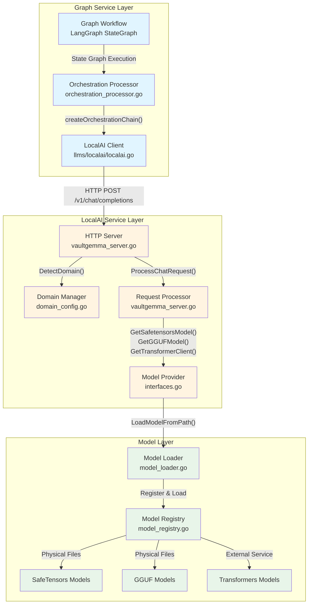
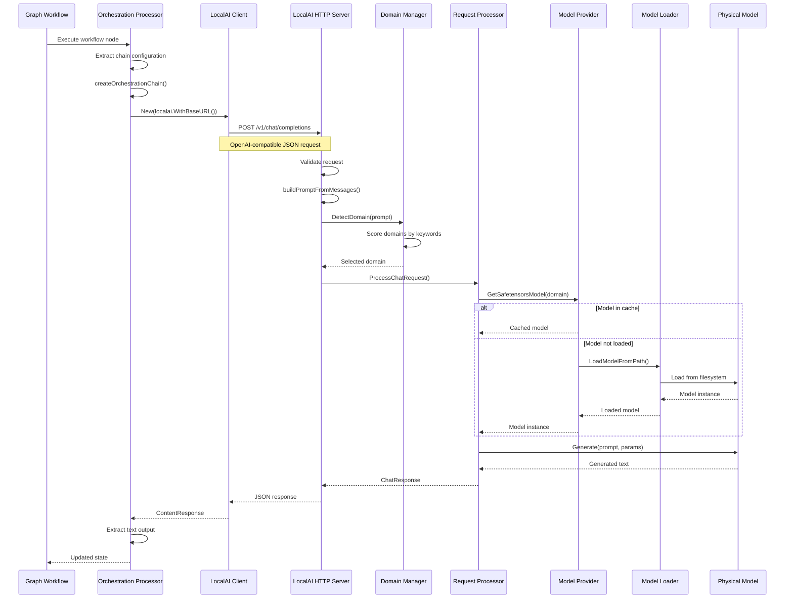
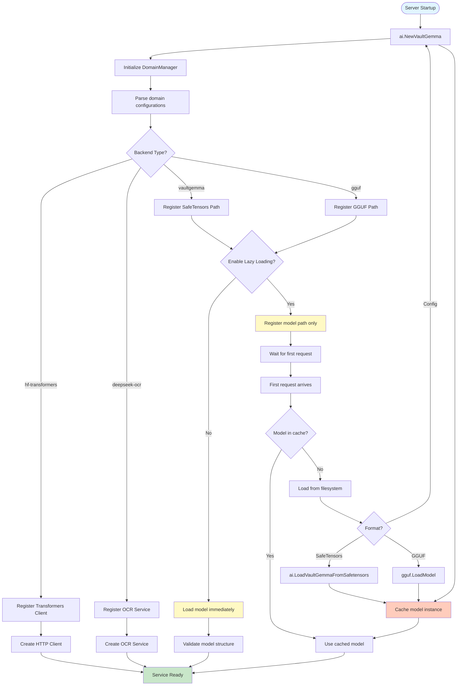
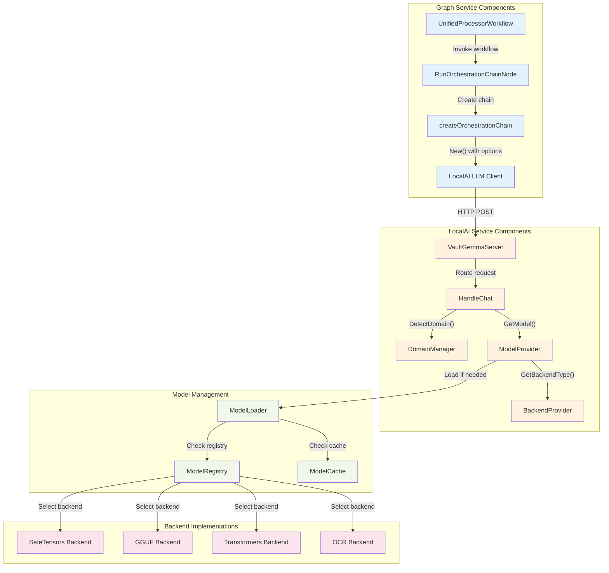

# Architecture Diagrams: Graph-LocalAI-Models Abstraction

This document contains Mermaid diagrams illustrating the abstraction layers between the Graph service, LocalAI service, and underlying models.

## System Architecture Diagram

## Abstraction Layer Diagram

```mermaid
graph LR
    subgraph "Layer 1: Graph Service"
        A1[LangGraph Workflow]
        A2[Orchestration Chain]
        A3[LocalAI Client Wrapper]
    end
    
    subgraph "Layer 2: API Abstraction"
        B1[HTTP REST API<br/>OpenAI-Compatible]
        B2[Request/Response Format]
    end
    
    subgraph "Layer 3: LocalAI Service"
        C1[Domain Router]
        C2[Model Provider Interface]
        C3[Backend Provider Interface]
        C4[Request Processor Interface]
    end
    
    subgraph "Layer 4: Model Abstraction"
        D1[ModelLoader Interface]
        D2[Model Registry]
        D3[Backend Adapters]
    end
    
    subgraph "Layer 5: Physical Models"
        E1[SafeTensors Files]
        E2[GGUF Files]
        E3[Transformers Service]
    end
    
    A1 --> A2
    A2 --> A3
    A3 -->|"HTTP Client"| B1
    B1 --> B2
    B2 --> C1
    C1 --> C2
    C2 --> C3
    C3 --> C4
    C4 --> D1
    D1 --> D2
    D2 --> D3
    D3 --> E1
    D3 --> E2
    D3 --> E3
    
    style A1 fill:#bbdefb
    style A2 fill:#bbdefb
    style A3 fill:#bbdefb
    style B1 fill:#c8e6c9
    style B2 fill:#c8e6c9
    style C1 fill:#fff9c4
    style C2 fill:#fff9c4
    style C3 fill:#fff9c4
    style C4 fill:#fff9c4
    style D1 fill:#ffccbc
    style D2 fill:#ffccbc
    style D3 fill:#ffccbc
    style E1 fill:#f8bbd0
    style E2 fill:#f8bbd0
    style E3 fill:#f8bbd0
```

## Request Flow Diagram

## Model Loading Flow Diagram

## Component Interaction Diagram

## Code Reference Map

### Graph Service → LocalAI Interface

**File**: `services/graph/pkg/workflows/orchestration_processor.go`
- **Function**: `createOrchestrationChain()` (line 321)
- **Function**: `RunOrchestrationChainNode()` (line 48)

**File**: `infrastructure/third_party/orchestration/llms/localai/localai.go`
- **Type**: `LLM` struct (line 21)
- **Function**: `New()` (line 98)
- **Function**: `GenerateContent()` (line 161)

### LocalAI Service Internal

**File**: `services/localai/pkg/server/vaultgemma_server.go`
- **Type**: `VaultGemmaServer` struct (line 77)
- **Function**: `HandleChat()` (line 197)

**File**: `services/localai/pkg/domain/domain_config.go`
- **Type**: `DomainManager` struct (line 109)
- **Function**: `DetectDomain()` (line 226)

**File**: `services/localai/pkg/server/interfaces.go`
- **Interface**: `ModelProvider` (line 17)
- **Interface**: `BackendProvider` (line 29)
- **Interface**: `RequestProcessor` (line 39)

**File**: `services/localai/pkg/models/model_loader.go`
- **Type**: `ModelLoader` struct (line 13)
- **Function**: `LoadModelFromSafeTensors()` (line 25)
- **Function**: `LoadModelFromPath()` (line 125)

**File**: `services/localai/pkg/server/model_registry.go`
- **Type**: `ModelRegistry` struct (line 20)
- **Function**: `GetRequirements()` (line 120)

